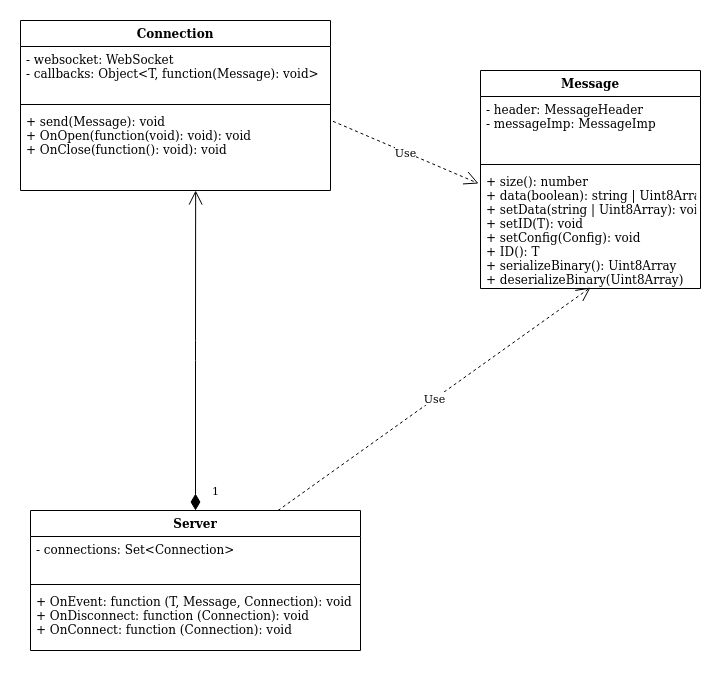

# eventsocketserverjs
An event based networking library built for NodeJS servers. 

## Overview:

Here at Redback, We develop software that allows us to make use of the sensor data that
are on the cars we make, and for that to happen, we rely heavily on developing networking frameworks that suite our need. One such framework is EventSocket. What EventSocket allows us to do is send events asynchronously between C++ servers and clients, and JavaScript clients running on browsers, so that we can robustly send data. However, we are currently missing a NodeJS server implementation of EventSocket. While reading the spec, it is recommended to look at the other implementations which are found here:

- **eventsocketcpp**: [here](https://github.com/UNSW-Redback-Racing/eventsocketcpp) 
- **eventsocketclientjs**: [here](https://github.com/UNSW-Redback-Racing/eventsocketclientjs)

## Specifications to implement:
The general structure should contain a WebSocket Server (the dependencies requiredare included in the package.json file) which is driven by an expressjs server for handling incoming HTTPS requests and elevating those connections to WebSocket connections. Your task is to implement a wrapper for such a server, as well as a wrapper for WebSockets to allow us to assign custom events for each WebSocket. The following UML diagram shows what the structure looks like. Note that you are not required to implement the Message class, as it is already done for you. However, I recommend you to have a look at its implementation to understand what is going on. 